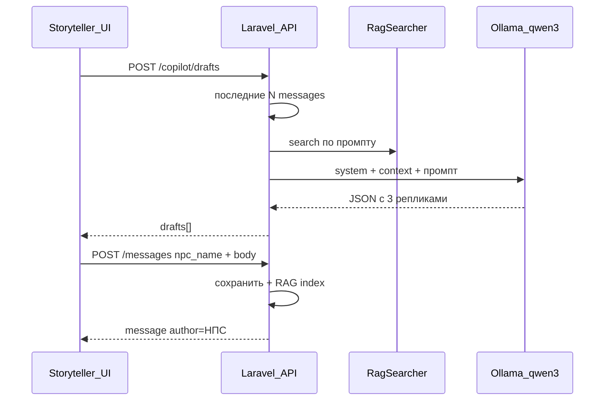

# Copilot: этапы 5–6 (без модели мира)

## Текущая позиция

| Этап | Содержание | Статус |
|------|------------|--------|
| 1–3 | Sail, auth, чат, роли, пустая панель ST | Готово |
| 3.5 | RAG + Ollama (`nomic-embed-text`, `qwen3:8b`) | Готово |
| **4** | Модель мира (лор-файлы, НПС, граф, события) | **Отложен** |
| **5–6** | Copilot + пайплайн генерации | **Эта работа** |

После реализации — **конец этапа 6 (MVP copilot)** без таблиц НПС/событий: имя НПС вводится вручную.

---

## Продуктовое поведение

Рассказчик в боковой панели `frontend/src/views/ChatView.vue`:

1. Вводит **имя НПС** и **ситуационный промпт** («что должно произойти / тон / контекст»).
2. Жмёт **Сгенерировать** → API возвращает **3 черновика** (не отправляются автоматически).
3. Выбирает черновик, **редактирует** при необходимости.
4. Жмёт **Отправить в чат** → сообщение появляется в общей ленте с автором = имя НПС.

Игроки панель не видят. Обычная отправка сообщений от своего имени не меняется.

---

## Поток данных

---

## Backend

### 1. Сообщения от имени НПС

Миграция: в `messages` добавить nullable `npc_name` (string, max 64).

- `user_id` — всегда рассказчик (аудит, кто нажал «отправить»).
- В `ChatController::serialize`: `author` = `npc_name ?? user.name`; `mine` = `false`, если задан `npc_name`.
- `StoreMessageRequest`: опциональное `npc_name`; если передано — только для `isStoryteller()`, иначе 403.
- Индексация RAG: в `metadata` добавить `npc_name` при наличии.

### 2. Copilot API

`POST /api/copilot/drafts` (middleware `auth:sanctum` + `storyteller`)

Request: `npc_name` (required), `prompt` (required, max 2000)

Response: `{ "drafts": ["...", "...", "..."] }`

### 3. Сборка промпта (`NpcCopilotService`)

Конфиг `config/copilot.php`: `history_limit`, `rag_limit`, `draft_count`.

### 4. Расширение LLM-клиента

`ChatProvider::chat(array $messages)` для system + user в Ollama.

### 5. Ошибки

Ollama недоступна → 503; невалидный JSON ответа → 502.

---

## Frontend

Панель рассказчика: поля НПС и промпт, генерация, 3 карточки, редактирование, отправка.

---

## Вне scope

- Таблицы `npcs`, `events`, `relationships`, файлы `world/`
- Стриминг, `laravel/ai`
