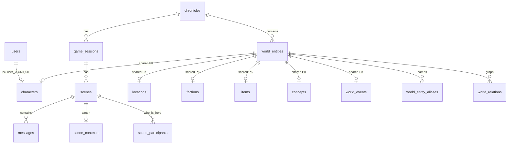
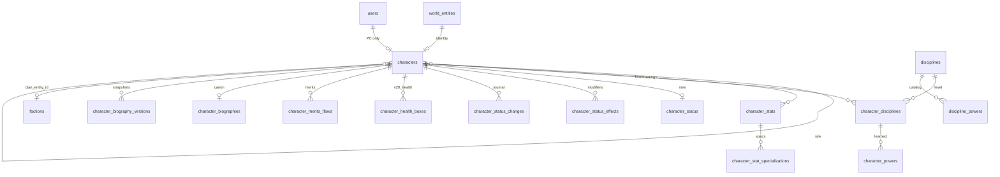
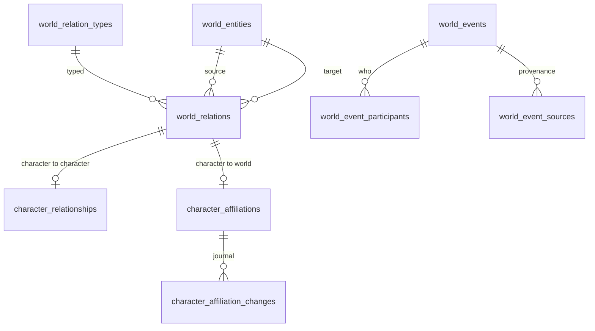
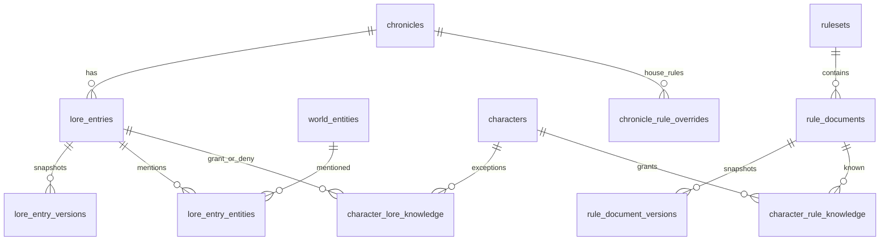
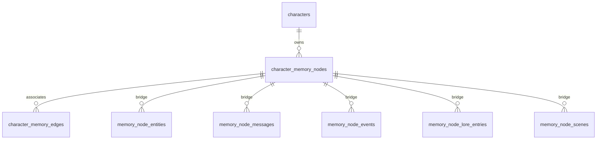

# Схема базы данных

Каноническая ER-схема PostgreSQL. Graph в Obsidian показывает связи **заметок**, не таблиц: смотреть схему нужно здесь.

Корень всего — `chronicles`. Имя сущности не ID: стабильный ключ — `world_entities.id`. Typed-таблицы (`characters`, `locations`, …) имеют тот же `id`, что и identity.

Канон живёт в обычных таблицах. `*_chunks`, `message_embeddings`, `tsvector` и HNSW — производные индексы, их можно пересчитать.

Подробности полей: [[Architecture/World]], [[Architecture/Memory]], [[Architecture/Lore]], [[Architecture/Rules]], [[Architecture/Backend]]. Миграции: `database/migrations/`.

## Каркас мира и игры



## Лист персонажа

Один пользователь = один PC (`characters.user_id` unique). Гули — отдельные `characters` с `character_type=ghoul` и `domitor_character_id` на вампира (PC или NPC). `user_id` у гуля пуст: доступ игрока идёт через домитора.

Сир (`sire_character_id`) — Объятья. Домитор гуля — не сир.

Рейтинг листа (сила 3) — `character_stats`. Текущие ресурсы сессии (кровь, временная воля) — `character_status` с журналом и `revision`.



`character_stats.category`: `attribute`, `ability`, `background`, `virtue`, `other`. Unique `(character_id, category, stat_key)`.

`characters.experience` — одно неотрицательное число (начисление и трата).

`character_status`: `temporary_willpower`, `blood_pool`, `hunger` (колонка V5, на листе V20 не показывать и не писать через sheet API), `health_state`, `fatigue`, `current_location_id`, `revision`. Канон здоровья на листе — 7 строк `character_health_boxes` (`box_index` 0–6, `damage` bashing/lethal/aggravated). SPA заполняет клетки префиксом слева направо; `health_state` выводится из худшей заполненной клетки (torpor с листа не ставится).

`character_merits_flaws`: `kind` merit/flaw, `name`, `cost`, optional `note`. Eloquent-модель задаёт `$table = 'character_merits_flaws'`.

## Игра: сессии, сцены, сообщения

```mermaid
erDiagram
  chronicles ||--o{ game_sessions : has
  users ||--o{ game_sessions : created_by
  game_sessions ||--o{ scenes : has
  scenes ||--o| scene_contexts : one
  scenes ||--o{ scene_participants : many
  scenes ||--o{ messages : many
  characters ||--o{ scene_participants : enters
  characters ||--o{ messages : author_character_id
  users ||--o{ messages : operator
  messages }o--o| copilot_requests : one_use
  locations ||--o| scene_contexts : location
```

Одна active `game_session` на хронику. Сообщения канон диалога; `user_id` — оператор (nullable после удаления аккаунта), `author_character_id` — кто говорит в мире.

## Граф мира



`controls` в каталоге — character/faction → location/faction, не вампир→гуль. Свита хранится в `domitor_character_id`.

## Лор, правила, знание



NPC видит статью, если `classification` ∈ `lore_clearance_levels` (smallint[]), плюс grant, минус deny; `situational` — только grant. `visibility` лора ≠ знание NPC. Собственная биография доступна без уровня статьи.

## Память персонажа



Текст воспоминания не становится каноном мира. Мосты только явные.

## Производные индексы (не канон)

- `character_bio_chunks` ← биография
- `lore_chunks` ← лор
- `game_rule_chunks` ← правила
- `message_embeddings` ← сообщения
- `character_memory_nodes.embedding` + `search_vector`

Таблицы `rag_chunks` нет.

## Очередь экстрактора

`extraction_runs` — аудит прогонов экстрактора. Поля: `chronicle_id`, `source_type` (`lore` \| `biography` \| `scene`), `source_id`, `status` / `trigger` / окно `from_message_id`–`to_message_id` (сцена), `driver`, `model`, `raw_response` (jsonb), `candidates` (jsonb), `user_id`. Лор/био: ошибочный вызов модели строку не создаёт. Сцена: run пишется сразу; parse/таймаут → `failed`. Курсор `scenes.last_extracted_to_message_id` двигается только после успешного окна. Accept в канон — лор/сцена (mentions, relations, events), био (memories). См. [[API/Extract]], [[Project/Extractor]].

## UI и backlog

HTTP-лист V20: [[API/Characters]], [[Features/Characters]]. Blood Per Turn нет: кровь — число `character_status.blood_pool`. Справочник мира: [[API/World]], [[Features/World]]. Лор: [[API/Lore]].

Ещё нет экранов (таблицы уже есть, пустые маршруты не добавлять):

- CRUD памяти в SPA.
