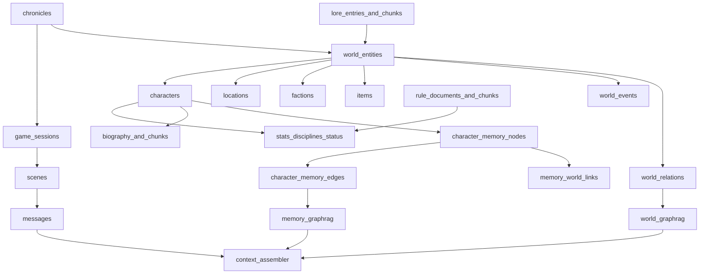

# Переход на новую архитектуру

**Статус:** основной план завершён 2026-09-11. Этапы 0–9, 11–16 и 18–35 выполнены; этапы 10 и 17 сняты.

Этот документ — канонический план перехода проекта к полноценной базе хроники. Старые планы про лёгкий контекст и прежние пункты 12–16 больше не определяют дальнейшую работу.

## Границы и неизменяемые правила

- Исходная точка — фактическая рабочая копия после снятия L0/L1/intent: `messages` остаётся каноном диалога, `copilot_requests` — аудитом генераций, `search_messages`/`get_message_range` — рабочими retrieval tools.
- Не восстанавливать summaries, intent memory и глобальный пассивный message-RAG.
- Не разрабатывать UI наполнения, импорт Markdown/CSV/JSON, NLP-извлечение, генерацию ассоциаций и автоматическое создание канона.
- Проект домашний: один рассказчик, без сложного membership/RBAC. Сохраняются Sanctum и текущая storyteller-проверка; добавляются только ограничения, необходимые для целостности данных и корректного knowledge scope NPC.
- PostgreSQL — источник истины. Embeddings, `tsvector` и поисковые чанки — производные данные, которые можно восстановить.
- Новые этапы не начинать до зелёной приёмки предыдущего. После каждого этапа обновлять статус здесь.

## Прогресс

- [x] Этап 0: безопасная исходная точка
- [x] Этап 1: канонический план в Obsidian
- [x] Этап 2: отключить Redis по умолчанию
- [x] Этап 3: развести хронику, игровую встречу и сцену
- [x] Этап 4: общая идентичность сущностей мира
- [x] Этап 5: типизированные сущности мира
- [x] Этап 6: ядро персонажа (без `character_users`; 1 пользователь = 1 персонаж)
- [x] Этап 7: реляционные характеристики
- [x] Этап 8: дисциплины и изученные силы
- [x] Этап 9: текущее состояние персонажа
- [x] Этап 10: цели персонажа — **снят**, не реализуется
- [x] Этап 11: каноническая биография
- [x] Этап 12: векторный индекс биографии
- [x] Этап 13: каталог типов мировых связей
- [x] Этап 14: универсальный мировой граф
- [x] Этап 15: межперсонажные отношения (без метрик)
- [x] Этап 16: affiliations
- [x] Этап 17: внутриигровое время — **снят**, не реализуется
- [x] Этап 18: структурированные события мира
- [x] Этапы 19–23: лор, правила и знания NPC
- [x] Этап 24: узлы личной памяти
- [x] Этап 25: рёбра ассоциаций памяти
- [x] Этап 26: мосты памяти к канону
- [x] Этапы 27–30: retrieval и два GraphRAG-контура
- [x] Этап 31: Context Assembler
- [x] Этап 32: канонический контекст сцены
- [x] Этап 33: API, целостность и история
- [x] Этап 34: производительность, надёжность и наблюдаемость
- [x] Этап 35: cutover, очистка legacy и финальная документация

## 0. Безопасная исходная точка

- Проверить миграции, отсутствие старых summary/intent jobs и `rag_chunks(source_type=summary)`, полный backend suite и frontend build.
- Зафиксировать тестами существующие гарантии: scene-scoped сообщения, read-only закрытой сцены, одноразовая связь `copilot_requests → messages`, session-scoped tools и токен-бюджет.
- Не перетирать текущие незакоммиченные изменения. Новые миграции только продолжают существующую цепочку.

**Приёмка:** текущая архитектура воспроизводимо зелёная до добавления новых сущностей.

**Результат (2026-09-11):**

- Миграции на рабочей БД все `Ran`, включая `2026_09_09_000001_drop_context_summary_and_intent_tables`. Новых таблиц этапа 0 не добавлялось.
- Таблицы `context_summaries`, `context_summary_sources`, `scene_context_states`, `storyteller_intent_summaries` отсутствуют. В `rag_chunks` нет `source_type=summary`. В `jobs` нет payload L0/intent.
- Единственный runtime job — `IndexRagMessageJob`. В `app/Context/` только `ContextBuilder`, `ContextBuild`, `TokenEstimator`.
- Гарантии уже покрыты тестами и подтверждены suite:
  - scene-scoped сообщения — `ChatTest::test_message_lists_are_isolated_by_scene`
  - закрытая сцена read-only — `ChatTest::test_closed_scene_is_readable_but_rejects_new_messages`
  - одноразовая связь `copilot_requests → messages` — `CopilotTest::test_copilot_request_cannot_be_reused`
  - session-scoped tools — `RetrievalToolsTest`
  - токен-бюджет — `CopilotTest` (12000 и newest-within-budget)
- `php artisan test` — **36 passed** (144 assertions).
- `frontend`: `npm run build` — успех (Vite 7.3.6).

## 1. Канонический действующий план в Obsidian

- Создать `docs/Project/Architecture Migration.md` с теми же этапами, статусами, решениями схемы и критериями приёмки.
- В [[Project/Roadmap]] заменить старое направление краткой ссылкой и прогрессом перехода.
- Добавить ссылку из [[Home]]; после каждого завершённого этапа обновлять checkbox/status и фактические отклонения от плана.

**Приёмка:** Cursor-план и Obsidian показывают одинаковый текущий этап и фактический прогресс.

**Результат (2026-09-11):**

- Этот документ — канон: 35 этапов, границы, схема, критерии приёмки, статусы и результаты.
- [[Project/Roadmap]] больше не ведёт пункты 12–16; дальнейшая работа только через эту заметку.
- [[Home]] ссылается на этот план как на основной.
- Cursor-план `переход_на_новую_архитектуру_a4fe8197.plan.md` разбит по этапам 0, 1, 2: этап 0 `completed`, этап 1 `completed`, этап 2 `pending`. Это совпадает с чекбоксами выше.

## 2. Отключить Redis по умолчанию

- В `compose.yaml` убрать Redis из обязательных `depends_on`, перевести сервис и volume в opt-in Compose profile `future`.
- Оставить Laravel Redis connections как задел, но закрепить в `.env.example`: `CACHE_STORE=database`, `QUEUE_CONNECTION=database`, `SESSION_DRIVER=database`; `RAG_INDEX_SYNC=true` остаётся обычным режимом.
- Проверить API, auth, сообщения, Copilot, sync indexing и database queue без Redis-контейнера.
- Обновить [[Development/Setup]] и [[Development/Environment]]: Redis не хранит канон и не нужен для обычного запуска.

**Приёмка:** полный проект и тесты работают при полностью остановленном Redis.

**Результат (2026-09-11):**

- `compose.yaml`: Redis убран из `depends_on` у `laravel.test` и `queue`; сервис `redis` и volume `sail-redis` остаются, сервис только с profile `future`.
- `.env.example`: `CACHE_STORE=database`, `QUEUE_CONNECTION=database`, `SESSION_DRIVER=database`, `RAG_INDEX_SYNC=true`. Блок `REDIS_*` оставлен как задел с комментарием, что контейнер не стартует по умолчанию.
- Laravel Redis connections в `config/database.php` не удалялись.
- `docker compose config --services` без профиля не включает `redis`; с `--profile future` — включает.
- Контейнер Redis остановлен и удалён. `php artisan test` — **36 passed**. Runtime: `queue=database`, `cache=database`, `session=database`, `index_sync=true`.
- HTTP без Redis: `/up` 200, `POST /api/register` выдаёт токен, `GET /api/messages` работает, `POST /api/copilot/drafts` для player даёт 403 (ожидаемо). Copilot как storyteller покрыт suite.
- Database queue: `IndexRagMessageJob::dispatch` попал в `jobs` (0→1), worker обработал запись, `jobs=0`, `failed_jobs=0`.
- Обновлены [[Development/Setup]] и [[Development/Environment]].

## 3. Развести хронику, игровую встречу и сцену

- Добавить `chronicles`: title, description, setting, status, created_by, started_at, archived_at.
- Добавить обязательный `game_sessions.chronicle_id`; backfill через одну служебную хронику без потери существующих данных.
- Заменить глобальный partial unique активной сессии на «одна active game session на chronicle».
- Не добавлять membership/RBAC; текущий storyteller управляет всеми хрониками. В доменных запросах всё равно передавать `chronicle_id` как смысловой scope.
- Добавить модели, factories и тест изоляции данных двух хроник.

**Приёмка:** несколько хроник могут иметь независимые активные игровые встречи; сцены и сообщения не смешиваются.

**Результат (2026-09-11):**

- Таблица `chronicles`: title, description, setting, status, created_by, started_at, archived_at. Модель `Chronicle`, enum `ChronicleStatus`, `ChronicleFactory`.
- Существующие `game_sessions` привязаны к служебной хронике «Основная хроника» без потери данных; `chronicle_id` обязателен.
- Partial unique `game_sessions_single_active` заменён на `game_sessions_one_active_per_chronicle` (`chronicle_id` WHERE status = active).
- Membership/RBAC не добавлялись. `chronicle_id` — смысловой scope: `GET/POST /api/game-sessions`, `GET/POST /api/messages`, `POST /api/copilot/drafts`, `RetrievalScope` и RAG metadata сообщений. Без параметра используется служебная хроника (первая по `id`); UI выбора хроники нет.
- `tests/Feature/ChronicleIsolationTest.php`: две хроники держат независимые active-сессии; сообщения не смешиваются; создание сессии в одной хронике не архивирует другую; две active-сессии в одной хронике запрещены индексом.
- `php artisan test` — **38 passed** (170 assertions).
- Cursor-план `переход_на_новую_архитектуру_a4fe8197.plan.md`: этап 3 `completed`, этапы 4–5 остаются pending.

## 4. Общая идентичность сущностей мира

- Добавить `world_entities`: chronicle_id, entity_type (`character`, `faction`, `location`, `item`, `concept`, `event`), canonical_name, slug, short_description, status, archived_at.
- Добавить `world_entity_aliases`: entity_id, alias, normalized_alias, alias_type, language.
- Ввести domain service, который создаёт typed entity и `world_entities` атомарно.
- Запретить физическое удаление участвующей в истории сущности; использовать архивирование.
- Добавить индексы `(chronicle_id, entity_type)`, normalized aliases и проверки принадлежности одной хронике.

**Приёмка:** граф, лор, события и память используют стабильные IDs, а не имена и полиморфные невалидируемые ссылки.

**Результат (2026-09-11):**

- Таблицы `world_entities` и `world_entity_aliases`. Типы: `character`, `faction`, `location`, `item`, `concept`, `event`. Индексы `(chronicle_id, entity_type)`, уникальные `(chronicle_id, slug)` и `(chronicle_id, normalized_alias)`, один `canonical` alias на сущность.
- Составной FK `(entity_id, chronicle_id)` запрещает алиас чужой хроники. `WorldEntityService` создаёт typed identity (`entity_type` + `world_entities`) и алиасы атомарно; `findByAlias` и `assertSameChronicle` держат chronicle scope.
- Физическое удаление запрещено: Eloquent `delete()` и PostgreSQL `BEFORE DELETE` триггер. Вместо этого `archive()`. Типизированные таблицы этапа 5 не добавлялись. HTTP CRUD и UI нет.
- `php artisan test` — **45 passed** (195 assertions).
- Cursor-план: этап 4 `completed`, этап 5 pending.

## 5. Типизированные сущности мира

- Добавить shared-PK/FK таблицы `locations`, `factions`, `items`, `concepts` поверх `world_entities`.
- `locations`: parent_location_id, location_type, structured details.
- `factions`: parent_faction_id, faction_type, status.
- `items`: owner_entity_id nullable, item_type, status.
- `concepts`: concept_type, short definition.
- Добавить модели, relations, factories и constraints совпадения `entity_type` с typed table.

**Приёмка:** группы, места, имущество и взгляды имеют нормальные FK-цели для affiliations и графа.

**Результат (2026-09-11):**

- Shared-PK таблицы `locations`, `factions`, `items`, `concepts` поверх `world_entities`. Поля: parent location/faction, `location_type` + jsonb `details`, faction/item status, `owner_entity_id`, concept `definition`.
- Constraint `(id, entity_type)` и CHECK не дают повесить location на faction identity. Parent/owner привязаны к той же хронике составным FK.
- `WorldEntityService::create` атомарно пишет identity + typed-строку + алиасы. Модели, factories, `tests/Feature/TypedWorldEntityTest.php`. HTTP CRUD нет. `characters` не добавлялись.
- `php artisan test` — **51 passed** (223 assertions).
- Cursor-план: этап 5 `completed`, этапы 6–10 pending.

## 6. Ядро персонажа и переход со строкового NPC

- Добавить `characters` с shared world entity ID: character_type (`player`, `npc`), clan_entity_id, sire_character_id, generation, apparent_age, actual_age, nature, demeanor, concept, active flag.
- **Отклонение:** таблица `character_users` не добавляется. Связь игрока с персонажем — nullable unique `characters.user_id` (глобально один PC на пользователя). NPC: `user_id` IS NULL. CHECK: player ⇒ `user_id` NOT NULL; npc ⇒ `user_id` IS NULL.
- Добавить nullable `messages.author_character_id`: `user_id` остаётся оператором отправки, character ID — автором реплики в мире.
- Добавить nullable `copilot_requests.character_id`; сохранить `npc_name` как исторический snapshot имени.
- Новые backend-контракты сначала принимают оба варианта, затем переключаются на `character_id`; старые строки не backfill автоматически, пока нет утверждённого сопоставления.
- Обновить `Message::displayAuthor()`, RAG metadata и audit tests.

**Приёмка:** переименование персонажа не разрывает сообщения, RAG и Copilot provenance; старые данные продолжают читаться.

**Результат (2026-09-11):**

- Shared-PK `characters` поверх `world_entities`. Поля: `character_type`, nullable unique `user_id`, clan/sire той же хроники, generation/ages, nature/demeanor/concept, `is_active`.
- Нет `character_users`: 1 пользователь = 1 персонаж. Игрок не может иметь второго PC (unique `user_id` глобально, не per-chronicle).
- `messages.author_character_id` и `copilot_requests.character_id` nullable. `npc_name` остаётся snapshot. Dual contract: `npc_name` и/или `character_id`; при обоих предпочтение у `character_id`. Старые строки не backfill.
- `displayAuthor()` читает живое `world_entities.canonical_name` по `author_character_id`, иначе snapshot `npc_name`, иначе `user.name`. RAG metadata: `character_id` + snapshot `npc_name`.
- HTTP CRUD персонажей нет. UI по-прежнему может слать только `npc_name`.
- `php artisan test` — **65 passed** (277 assertions).
- Cursor-план: этап 6 `completed`, этапы 7–10 pending.

## 7. Реляционные характеристики

- Добавить `character_stats`: character_id, category, stat_key, display_name, value, maximum, sort_order, metadata; unique `(character_id, category, stat_key)`.
- Добавить `character_stat_specializations`: character_stat_id, name, description, active flag.
- Не хранить весь лист одним JSON и не добавлять колонку на каждый stat.
- Реализовать domain read model для выборки полного листа и ограниченного набора релевантных характеристик для будущего prompt.

**Приёмка:** характеристики и специализации валидируются и SQL-запросом находятся по типу/значению.

**Результат (2026-09-11):**

- Таблицы `character_stats` (category, stat_key, display_name, value, maximum, sort_order, jsonb `metadata`) и `character_stat_specializations`. Unique `(character_id, category, stat_key)`. Лист не хранится одним JSON.
- `App\Character\CharacterStatService` пишет/обновляет строки; `CharacterSheetReader` отдаёт полный лист и урезанный набор (category/key/min value) для будущего prompt. HTTP CRUD нет.
- `php artisan test` — **72 passed** (293 assertions).
- Cursor-план: этап 7 `completed`, этапы 8–10 pending.

## 8. Дисциплины и изученные силы

- Добавить каталоги `disciplines` и `discipline_powers`; discipline связывается с ruleset, power — с required level и правилом.
- Добавить `character_disciplines` (`character_id`, `discipline_id`, `level`) и `character_powers` (`character_id`, `discipline_power_id`, acquired_at, note).
- JSONB разрешить только для нестандартных параметров силы, но не для списка дисциплин/сил.
- Добавить constraints уровня, уникальности и совместимости изученной силы с дисциплиной.

**Приёмка:** обычным SQL можно найти персонажей с конкретной дисциплиной, уровнем и силой.

**Результат (2026-09-11):**

- Каталоги `disciplines` (`ruleset` + `key`) и `discipline_powers` (`required_level`, `rule_key` без FK на будущие `rule_documents`). Изученное: `character_disciplines`, `character_powers`.
- JSONB только у `character_powers.parameters`. Список дисциплин/сил — строки. Unique character+discipline / character+power. Составной FK: сила принадлежит той же дисциплине, что и лист персонажа.
- Триггеры: уровень дисциплины ≥ required_level силы; нельзя понизить уровень ниже уже изученных сил.
- `App\Character\DisciplineService`. HTTP CRUD нет.
- `php artisan test` — **78 passed** (310 assertions).
- Cursor-план: этап 8 `completed`, этапы 9–10 pending.

## 9. Текущее состояние персонажа

- Добавить one-to-one `character_status`: temporary_willpower, blood_pool, hunger, health state, fatigue, current_location_id, revision.
- Добавить `character_status_effects`: тип, описание, modifier, active_from/active_until, источник и active flag для штрафов, бонусов, ранений и временных эффектов.
- Добавить `character_status_changes`: field, old/new values, reason, scene/message/event references, game time, changed_by.
- Изменение current row и append журнала выполнять одной транзакцией с optimistic revision.

**Приёмка:** текущее состояние читается быстро, а каждое изменение объяснимо историей.

**Результат (2026-09-11):**

- One-to-one `character_status`: willpower, blood_pool, hunger, health_state, fatigue, `current_location_id` той же хроники, `revision`.
- `character_status_effects` (penalty/bonus/wound/temporary, modifier jsonb, active window, источник type/id, `is_active`).
- `character_status_changes`: field, old/new, reason, scene/message, `game_time` (опциональная строка-метка; шкала хроники снята), `changed_by`. FK на `world_events` нет — таблицы ещё нет.
- `CharacterStatusService::apply` в одной транзакции: lock, optimistic revision, update current, append journal. HTTP CRUD нет.
- `php artisan test` — **84 passed** (327 assertions).
- Cursor-план: этап 9 `completed`. Этап 10 снят, не реализуется.

## 10. Цели персонажа — снят

Этап снят по решению продукта: таблица `character_goals` **не создаётся** и не планируется. Изменяемые цели не входят в канон хроники и не прячутся в биографию.

**Приёмка исходного плана не применяется.**

**Результат (2026-09-11):**

- Таблицы `character_goals` нет; тест `CharacterBiographyTest::test_character_goals_table_is_not_created`.
- Следующий реализованный этап — 11.

## 11. Каноническая биография

- Добавить `character_biographies`: character_id, summary, full_text, principles, motivation, fears, desires, behavioral_rules, current_version, approval metadata.
- Добавить immutable `character_biography_versions` с полным snapshot и причиной изменения.
- Пока не делать UI и автоматическое наполнение; tests/factories создают минимальные записи через domain service.

**Приёмка:** биография версионируется и остаётся каноном независимо от поискового индекса.

**Результат (2026-09-11):**

- One-to-one `character_biographies`: текстовые поля канона, `current_version`, `status` (`draft`/`approved`), `approved_at`/`approved_by`.
- Immutable `character_biography_versions`: полный snapshot + `change_reason`; UPDATE/DELETE запрещены Eloquent и триггером PostgreSQL.
- `CharacterBiographyService::publish` пишет current row и версию в одной транзакции; индекс не трогает. `approve` не создаёт новую версию. HTTP CRUD нет.
- `php artisan test` — **93 passed** (355 assertions).
- Cursor-план: этап 11 `completed`, этап 12 pending.

## 12. Векторный индекс биографии

- Добавить `character_bio_chunks`: biography_version_id, character_id, chunk_index, section, content, `vector(1024)`, token estimate, metadata и отдельный HNSW.
- Реализовать отдельные `CharacterBioIndexer`/`CharacterBioSearcher`; не складывать био в общий `rag_chunks`.
- Индексировать только сохранённую версию; неудачная индексация не меняет канон, повторная — идемпотентна.
- Поиск всегда фильтрует по `character_id` до top-K.

**Приёмка:** индекс биографии удаляется и полностью восстанавливается из versioned canonical text.

**Результат (2026-09-11):**

- `character_bio_chunks` с отдельным HNSW; unique `(biography_version_id, chunk_index)`. Не пишется в `rag_chunks`.
- `CharacterBioIndexer::indexVersion` эмбеддит до замены строк: ошибка embedding оставляет канон и прежний индекс. Повторная индексация идемпотентна и снимает чанки предыдущей версии персонажа.
- `CharacterBioSearcher` всегда `WHERE character_id` до top-K.
- `rebuildForCharacter` восстанавливает индекс из `current_version`.
- `php artisan test` — **100 passed** (383 assertions).
- Cursor-план: этап 12 `completed`, этап 13 pending.

## 13. Каталог типов мировых связей

- Добавить `world_relation_types`: key, display_name, allowed source/target entity types, symmetric, transitive, default_weight, enabled.
- Первоначальные типы: knows, member_of, located_at, owns, controls, allied_with, hostile_to, created, participated_in, caused, witnessed.
- Добавить validator направления и допустимых типов узлов.

**Приёмка:** семантика каждого ребра явна и расширяется без миграции основной таблицы.

**Результат (2026-09-11):**

- `world_relation_types`: key, display_name, allowed source/target `WorldEntityType`, symmetric, transitive, default_weight, enabled.
- Сид 11 типов: knows, member_of, located_at, owns, controls, allied_with, hostile_to, created, participated_in, caused, witnessed (`WorldRelationTypeCatalog`).
- `WorldRelationTypeValidator` проверяет enabled, chronicle scope, направление и допустимые типы узлов. Таблицы `world_relations` нет.
- Новый тип — строка каталога, без миграции графа.
- `php artisan test` — **108 passed** (401 assertions).
- Cursor-план: этап 13 `completed`, этапы 14–16 pending.

## 14. Универсальный мировой граф

- Добавить `world_relations`: chronicle_id, source_entity_id, target_entity_id, relation_type_id, weight, note, started_at, ended_at, provenance, timestamps.
- Все рёбра направленные; симметрия задаётся типом и учитывается query layer, а не неявно.
- Запретить межхроникальные рёбра, нелегальные self-loop и логические дубли.
- Добавить индексы `(source_entity_id, relation_type_id)` и `(target_entity_id, relation_type_id)`.

**Приёмка:** любой персонаж, фракция, место, предмет, концепция или событие участвует в одном связном графе.

**Результат (2026-09-11):**

- `world_relations`: chronicle_id, source/target entity, relation_type_id, weight, note, started_at/ended_at, provenance. Индексы `(source_entity_id, relation_type_id)` и `(target_entity_id, relation_type_id)`.
- Рёбра строго направленные. Симметрия только в `WorldRelationService::neighbors` (входящие рёбра symmetric-типов), обратная строка не пишется.
- Запрещены self-loop, mixed chronicle, нелегальные типы, активный дубль `(source, target, type)`. После `end` можно создать новое ребро.
- `php artisan test` — **115 passed** (426 assertions).

## 15. Межперсонажные отношения

- Добавить `character_relationships` как typed extension `world_relations`: только source/target character (shared PK с ребром графа).
- **Отклонение:** метрики `like`, `trust`, `fear`, `debt`, `intimacy`, `respect`, поля `note`/`revision` на расширении и журнал `relationship_changes` **не добавляются**, пока не зафиксирован набор шкал.
- Все рёбра направленные: A→B не равно B→A; отдельное обратное ребро создаётся явно.
- HTTP CRUD нет.

**Приёмка исходного плана про журнал метрик отложена.** Текущая приёмка: отношение A→B отличается от B→A как направленное ребро графа.

**Результат (2026-09-11):**

- `character_relationships`: shared PK с `world_relations`, только `source_character_id` / `target_character_id`. Колонок like/trust/fear/debt/intimacy/respect/note/revision нет. Таблицы `relationship_changes` нет.
- `CharacterRelationshipService::connect` пишет ребро графа и typed-строку в одной транзакции. A→B и B→A — разные рёбра.
- `php artisan test` — **120 passed** (452 assertions).

## 16. Affiliations

- Добавить `character_affiliations` как typed extension ребра «character → world entity»: affiliation_type, stance, trust, loyalty, fear, obligation, role, rank, note, revision.
- Целью может быть faction, location, item или concept через `world_entities`.
- Добавить `affiliation_changes` для истории и те же транзакционные гарантии.

**Приёмка:** отношение к Камарилье, месту, имуществу и идее имеет валидный FK и участвует в world graph.

**Результат (2026-09-11):**

- `character_affiliations`: shared PK с `world_relations`; цель faction/location/item/concept; affiliation_type, stance, trust/loyalty/fear/obligation (0–5), role, rank, note, revision.
- Тип ребра по умолчанию — `affiliated_with` (строка каталога, без миграции схемы графа).
- `character_affiliation_changes` + `CharacterAffiliationService::apply` в одной транзакции с optimistic revision. HTTP CRUD нет.
- `php artisan test` — **126 passed** (473 assertions).

## 17. Внутриигровое время — снят

Этап снят: таблица `chronicle_timeline` **не создаётся**. Внутриигровое время на этом этапе не нужно. `world_events.timeline_id` не добавляется. Строка `game_time` в уже существующих журналах (status) остаётся опциональной меткой, не шкалой хроники.

**Приёмка исходного плана не применяется.**

**Результат (2026-09-11):** этап снят, `chronicle_timeline` нет.

## 18. Структурированные события мира

- Добавить `world_events` как typed world entity: scene_id nullable, title, description, event_type, status (`proposed`, `canonical`, `rejected`), importance, visibility, approval metadata. **Без `timeline_id`** (этап 17 снят).
- Добавить `world_event_participants`: event_id, entity_id, participant_role, note.
- Добавить `world_event_sources`: message/scene/copilot references и excerpt/provenance.
- Связи occurred_at, caused, witnessed и participated_in представлять через `world_relations`.
- Не извлекать события автоматически на этом этапе.

**Приёмка:** база отвечает «что, где и с кем произошло», не полагаясь только на свободный lore text.

**Результат (2026-09-11):**

- `world_events` — typed world entity: scene_id nullable, title, description, event_type, status (`proposed`/`canonical`/`rejected`), importance, visibility, approval. Колонки `timeline_id` нет.
- `world_event_participants` и `world_event_sources` (message/scene/copilot + excerpt).
- Связи `occurred_at`, `caused`, `witnessed`, `participated_in` через `world_relations`. Тип `occurred_at` добавлен строкой каталога.
- Автоизвлечения событий нет. HTTP CRUD нет.
- `php artisan test` — **131 passed** (494 assertions).

## 19. Канонический лор

- Добавить `lore_entries`: chronicle_id, title, kind, canonical_text, status, visibility, current_version, created/approved metadata.
- Добавить immutable `lore_entry_versions` и `lore_entry_entities` для many-to-many связей с миром.
- Не считать embeddings источником истины; не использовать текущий `RagIndexer::indexLore()` как каноническое сохранение.

**Приёмка:** лор версионируется, связан с сущностями/событиями и не является бесхозным `rag_chunks` content.

**Результат (2026-09-11):**

- `lore_entries` + immutable `lore_entry_versions` + `lore_entry_entities` (same-chronicle FK).
- `LoreEntryService::publish` не пишет `rag_chunks`. `RagIndexer::indexLore` остаётся legacy.
- HTTP CRUD нет.

## 20. Векторный индекс лора

- Добавить отдельный `lore_chunks`: lore version, chunk index, section, content, `vector(1024)`, `tsvector`, token estimate, metadata и HNSW/GIN.
- Реализовать `LoreIndexer`/`LoreSearcher` с обязательным `chronicle_id`, visibility/knowledge filters, similarity threshold и top-K.
- Backfill существующего legacy lore только после появления канонической `lore_entry`; несопоставимые чанки не переносить автоматически.

**Приёмка:** глобальный unscoped lore search невозможен, а индекс восстанавливается из утверждённых версий.

**Результат (2026-09-11):**

- `lore_chunks` (HNSW + GIN `tsvector`); индекс только из approved-версии.
- `LoreSearcher` требует `chronicle_id`; visibility и knowledge-filter (`knownLoreEntryIds`); cosine threshold.
- Несопоставимые `rag_chunks` lore не копируются автоматически.

## 21. Канонические игровые правила

- Добавить `rulesets`: name, edition, language, status, description.
- Добавить `rule_documents`: ruleset_id, title, section, canonical_text, source_reference, current_version, status.
- Добавить immutable `rule_document_versions`; связать rule documents с disciplines, powers, stats/effects через отдельные FK/pivots.
- Добавить `chronicle_rule_overrides` для house rules без изменения базового документа.

**Приёмка:** базовое правило, edition и override хроники различимы и версионируются.

**Результат (2026-09-11):**

- `rulesets`, `rule_documents`, immutable `rule_document_versions`.
- Pivots: disciplines, powers, stat keys, effect types.
- `chronicle_rule_overrides` не меняют базовый документ.

## 22. Векторный индекс правил

- Добавить `game_rule_chunks`: rule version, chunk index, section path, content, `vector(1024)`, `tsvector`, source/page reference, token estimate.
- Реализовать отдельные `RuleIndexer`/`RuleSearcher`; правила не смешивать одним vector query с лором или био.
- Поиск сначала применяет ruleset/edition/chronicle override, затем top-K.

**Приёмка:** нужная механика находится с источником и не подменяет канон мира.

**Результат (2026-09-11):**

- `game_rule_chunks` отдельно от lore/bio/`rag_chunks`.
- `RuleSearcher` требует ruleset или edition; approved override хроники подменяет base для этого документа.

## 23. Семантика видимости и знаний NPC

- Развести UI visibility (`public`, `storyteller_only`) и фактическое знание персонажа.
- Добавить `character_lore_knowledge`: character_id, lore_entry_id, knowledge_level, confidence, learned_at, source event/memory, approval metadata.
- При необходимости добавить аналогичную связь для правил; собственная биография и личная память доступны самому NPC по определению.
- `storyteller_only` факт не считать автоматически известным NPC. Это корректность генерации, а не сложная security-модель.

**Приёмка:** NPC не использует секрет рассказчика без явного knowledge grant или инструкции текущего prompt.

**Результат (2026-09-11):**

- `character_lore_knowledge` и `character_rule_knowledge`; `searchForCharacter` только по grants.
- `public` ≠ известно NPC. `storyteller_only` без grant не попадает в поиск персонажа.
- Собственная биография доступна без lore grant. HTTP CRUD нет.

## 24. Узлы личной памяти

- Добавить `character_memory_nodes`: character_id, node_text, `vector(1024)`, `tsvector`, node_type, importance, emotional_valence, arousal, confidence, false-belief flag, recall metrics, status, approval/provenance. **Без `timeline_id`** (этап 17 снят).
- Типы первого этапа: event, person, place, object, emotion, conclusion, promise, trauma, rumor.
- Реализовать `CharacterMemorySearcher`: vector + full-text + exact aliases + importance/recency/confidence; обязательный `character_id`.
- Не создавать nodes автоматически из сообщений.

**Приёмка:** субъективная, в том числе ложная, память ищется отдельно от объективного лора.

**Результат (2026-09-11):**

- `character_memory_nodes` без `timeline_id`; false-belief; aliases jsonb.
- `CharacterMemorySearcher` требует `character_id`; vector + FTS + exact alias; recall metrics при чтении не меняются.
- Сообщения не создают nodes.

## 25. Рёбра ассоциаций памяти

- Добавить `character_memory_edges`: character_id, source_node_id, target_node_id, relation_type, authored_weight, bidirectional flag, approval/provenance, timestamps.
- Первоначальные типы: caused_recall, same_place, same_person, opponent, scent_association, emotional_echo, consequence, contradiction, reinforces, precedes.
- DB/service constraint: оба узла принадлежат одному персонажу; запрет self-loop и дублей.
- Отделить authored weight от recall/traversal metrics, чтобы чтение не меняло смысл связи.

**Приёмка:** память образует контролируемый персонажный граф без self-reinforcing retrieval loop.

**Результат (2026-09-11):**

- `character_memory_edges`: оба узла одного персонажа; self-loop и дубли запрещены.
- `authored_weight` отделён от `traversal_count` / `last_traversed_at`; `neighbors()` не обновляет метрики.
- GraphRAG (depth/CTE) — этап 29. HTTP CRUD нет.
- `php artisan test` — **173 passed** (627 assertions).

## 26. Мосты памяти к канону

- Добавить `memory_node_entities` для связи memory node с `world_entities` и ролью сущности.
- Добавить FK-safe provenance pivots `memory_node_messages`, `memory_node_events`, `memory_node_lore_entries`, `memory_node_scenes`.
- Переход из memory graph в world graph разрешать только через эти явные мосты и с повторным knowledge filter.

**Приёмка:** личное воспоминание связано с реальными людьми/местами/событиями и источниками, но не становится объективным каноном.

**Результат (2026-09-11):**

- Pivots `memory_node_entities` (роль subject/mentioned/place/opponent/witness/other), `memory_node_messages`, `memory_node_events`, `memory_node_lore_entries`, `memory_node_scenes`.
- Составные FK держат node+character и entity/event/lore+chronicle; message/scene проверяются сервисом через сцену и сессию.
- `MemoryBridgeService`: переход в мир только по явным мостам; текст памяти не копируется в канон; lore/event для NPC фильтруются grants и visibility.
- HTTP CRUD нет.

## 27. Разделить поисковые корпуса

- Целевые корпуса: message embeddings, bio chunks, lore chunks, rule chunks, memory nodes.
- Для сообщений решить миграционно: оставить `rag_chunks` только для `message` или создать `message_embeddings`; выполнить dual-read/backfill перед cutover.
- Удалить enum-заделы `summary`/`npc`/`relationship` только после переключения всех потребителей.
- Каждый searcher обязан принимать собственный typed scope и не выполнять «поиск по всему».

**Приёмка:** запрос к биографии физически не затрагивает большой lore/rules корпус.

**Результат (2026-09-11):**

- Корпус сообщений — `message_embeddings` (chronicle/session/scene, HNSW + GIN). Dual-write из `RagIndexer::indexMessage`; dual-read в `MessageSearcher` с fallback на `rag_chunks(source_type=message)`.
- `search_messages` читает `MessageSearcher`, не общий `RagSearcher`. Enum-заделы `summary`/`npc`/`relationship` не удалялись (cutover — этап 35).
- `CharacterBioSearcher` / `LoreSearcher` / `RuleSearcher` не ходят в чужие таблицы; тест query log это фиксирует.

## 28. Hybrid retrieval и routing

- Добавить retrieval coordinator, который отдельно маршрутизирует запрос в messages, bio, memory, lore, rules и direct relational data.
- Для каждого корпуса объединять vector similarity, full-text rank, exact alias/entity match, recency и importance.
- Ввести typed retrieval result: source type/ID, score components, reason, filters, token estimate и provenance.
- Дедуплицировать повторные чанки документа, raw message против производного события и один факт из нескольких слоёв.

**Приёмка:** каждый включённый факт объясняет, из какого корпуса и почему он пришёл.

**Результат (2026-09-11):**

- `HybridRetrievalCoordinator` маршрутизирует messages/bio/memory/lore/rules и 1-hop `world_relations`. Copilot tool-loop не менялся.
- `RetrievalHit`: corpus, source, score components, reason, filters, token estimate, provenance.
- Дедуп: один хит на документ (lore/rules/bio version); raw message отбрасывается, если memory node уже цитирует его через мост.
- FTS добавлен в `character_bio_chunks`. `config/retrieval.php` — лимиты hybrid и GraphRAG.

## 29. GraphRAG личной памяти

- Vector/full-text search даёт ограниченные seed nodes выбранного персонажа.
- Реализовать PostgreSQL `WITH RECURSIVE` по `character_memory_edges`: depth ≤2, path-массив против циклов, min weight, limits узлов/рёбер и обязательный character scope.
- Ranking учитывает seed score, authored edge weight, depth decay, importance, recency и confidence.
- Возвращать компактный personal-memory bundle с node/edge IDs и provenance, а не весь граф.

**Приёмка:** тесты покрывают depth, циклы, слабые рёбра, изоляцию персонажей и стабильный bounded result.

**Результат (2026-09-11):**

- `MemoryGraphRag`: seed из `CharacterMemorySearcher` или явных nodes; `WITH RECURSIVE` по `character_memory_edges`, depth ≤2, path cycle guard, `min_abs_weight` 0.2, лимиты узлов/рёбер.
- Ranking: seed score, depth decay, authored weight, importance, confidence, recency. Чтение не меняет `recall_count` / `traversal_count`.
- Компактный `MemoryGraphBundle` (node/edge IDs и provenance).

## 30. GraphRAG мира

- Seed world entities из выбранного NPC, текущей сцены, exact aliases, lore results и мостов memory nodes.
- Реализовать отдельный `WITH RECURSIVE` по `world_relations`: depth ≤2, chronicle scope, allowlist relation types, path cycle guard, temporal validity и hard limits.
- Возвращать подписи сущностей, relation notes, relationship/affiliation metrics, canonical events и разрешённые lore chunks.
- Повторно применять knowledge filter после каждого перехода; GraphRAG не даёт NPC доступ ко всему storyteller-only графу.

**Приёмка:** тесты покрывают путь character→faction→location/event, циклы, межхроникальную изоляцию и knowledge leakage.

**Результат (2026-09-11):**

- `WorldGraphRag`: seed из NPC, сцены, exact alias, lore chunks и `memory_node_entities`; CTE по `world_relations` (chronicle, active, temporal, enabled types, symmetric incoming).
- После каждого перехода: storyteller-only events скрыты от NPC; lore chunks только по grants. Публичный лор без grant не попадает в NPC-bundle.
- Bundle: подписи сущностей, relation notes, affiliation metrics, canonical events, разрешённый лор.
- Copilot tools и Context Builder не подключены (этап 31). HTTP CRUD нет.
- `php artisan test` — **195 passed** (750 assertions).

## 31. Новый Context Assembler

- Заменить монолитное расширение `app/Context/ContextBuilder.php` композицией providers: scene, character profile, status, recent messages, direct relationships, biography, memory graph, world graph, lore, rules.
- Зафиксировать порядок: system → NPC identity → scene → status → storyteller prompt → recent messages → direct relations → bio → personal memory → world/lore → rules.
- У каждого provider: min/max token budget, priority, truncation policy и provenance; обязательные секции нельзя вытеснить GraphRAG.
- Сохранить существующий tool loop для старой истории; новые bounded retrieval-блоки можно собирать до LLM, не позволяя модели произвольно читать БД.
- Расширить `copilot_requests.context_metadata`: chronicle/character IDs, версии данных, IDs messages/chunks/nodes/edges, token counts по секциям и filters.

**Приёмка:** prompt воспроизводим, в бюджете и показывает точное происхождение каждого слоя.

**Результат (2026-09-11):**

- `ContextAssembler` (`context-assembler-v1`, prompt `npc-drafts-v6`) — композиция providers с фиксированным порядком: system → identity → scene → status → ST prompt → recent messages → 1-hop relations → каноническая биография → memory GraphRAG → world/lore GraphRAG → rules → closing.
- Обязательные секции резервируются первыми; GraphRAG зовётся только из leftover. Сообщения не режутся. Tool loop без изменений (`search_messages` / `get_message_range`), GraphRAG в Ollama tools не добавлен.
- Без `character_id` (legacy `npc_name`) character-слои пропускаются. Lore/rules только по grants. Биография — current row `character_biographies`, не вектор.
- `copilot_requests.context_metadata`: chronicle/character IDs, `section_token_counts`, provenance IDs (messages/nodes/edges/chunks), data versions, GraphRAG filters.
- Тесты: `ContextAssemblerTest`, версии в `CopilotTest`. HTTP CRUD мира/лора/памяти нет.
- Миграций этапа 31 нет.
- Сопутствующий фикс: `WorldGraphRag` сравнивает `started_at` с часами Laravel, не с `NOW()` PostgreSQL (расхождение PHP/PG и округление до секунды выкидывало только что созданные рёбра).

## 32. Канонический контекст активной сцены

- Добавить `scene_contexts`: scene_id, location_entity_id, atmosphere, situation, storyteller_notes, revision, updated_by. **Без `timeline_id`** (этап 17 снят).
- Добавить `scene_participants`: scene_id, character_id, role, visible, entered_at, left_at, current flag.
- Горячий контекст собирать из PostgreSQL: scene context, participants, character status/effects, последние 5–10 messages и direct relations. Redis не использовать.
- Закрытие сцены фиксирует последнюю revision и запрещает дальнейшие изменения; LLM при закрытии не вызывается.
- Не делать UI редактирования в этом плане; модели/API/domain services покрываются tests/factories.

**Приёмка:** закрытая сцена воспроизводима, а Context Assembler получает консистентный актуальный snapshot только из канона.

**Результат (2026-09-11):**

- Таблицы `scene_contexts` (1:1 со сценой, optimistic `revision`, `frozen_revision`, location той же хроники) и `scene_participants` (partial unique current `(scene_id, character_id)`). Без `timeline_id`.
- `SceneContextService` / `SceneParticipantService`: mixed-chronicle и closed scene → ошибка; закрытие сцены freeze последней revision, LLM не вызывается.
- `SceneProvider` читает atmosphere/situation/notes/location/current participants в блок `## Scene`. Redis нет.

## 33. API, целостность и история

- Добавить минимальные JSON endpoints/read services, необходимые Copilot и тестированию новых сущностей; полноценный storyteller CRUD UI отложен.
- Все доменные операции проверяют chronicle consistency, допустимые entity types, FK и optimistic revisions.
- Изменить опасный `messages.user_id cascadeOnDelete`: удаление аккаунта не должно удалять историю; использовать restrict или anonymized/null user при отдельной стратегии.
- Архивирование вместо удаления для персонажей, world entities, lore/rules и событий.
- Не строить сложный RBAC, но сохранить storyteller-only mutations и Sanctum.

**Приёмка:** нельзя создать dangling/mixed-chronicle граф, а удаление пользователя не уничтожает хронику.

**Результат (2026-09-11):**

- ST-only JSON: `GET/PUT /api/scenes/{scene}/context`, `GET/POST /api/scenes/{scene}/participants`, `PATCH .../participants/{character}` (leave). UI нет.
- `messages.user_id` nullable `ON DELETE SET NULL`; `displayAuthor` для удалённого оператора — «Аноним».
- Lore/rules: статус `archived`, Eloquent + PG trigger запрещают DELETE; персонажи/события по-прежнему архивируются через `world_entities`.

## 34. Производительность, надёжность и наблюдаемость

- Индексы: все FK, entity type/scope, aliases, active effects, source/target graph adjacency; отдельные HNSW и GIN каждого корпуса. Индексы шкалы времени не планируются (этап 17 снят).
- CTE guardrails: depth, cycle path, row limits, statement timeout, mandatory scope predicates.
- Идемпотентные index jobs, безопасная повторная индексация, failure tests Ollama/embedding provider и конкурентных revisions.
- Логировать время каждого provider/search/CTE, seed count, visited edges, rejected knowledge items и tokens по секциям.
- Не добавлять Redis-кеш до реального измерения необходимости.

**Приёмка:** `EXPLAIN ANALYZE` типовых поисков не показывает неограниченный scan/graph traversal; сбой производного индекса не повреждает канон.

**Результат (2026-09-11):**

- Индексы `(messages.scene_id, id)`, `(scenes.game_session_id, status)`, partial `world_relations` по активным source/target. HNSW/GIN корпусов уже были.
- GraphRAG CTE: `SET LOCAL statement_timeout` (`RETRIEVAL_STATEMENT_TIMEOUT_MS`), depth/cycle/`LIMIT`, chronicle/character predicates.
- `IndexRagMessageJob` unique по `message_id`; повторный index — upsert. Логи `context.section` и `retrieval.*_graphrag` (ms, tokens, seeds, edges, rejected knowledge). Redis-кеша нет.

## 35. Cutover, очистка legacy и финальная документация

- Переключить новые сообщения/Copilot с `npc_name` identity на `character_id`, сохранив snapshot имени для старого аудита.
- Переключить retrieval на отдельные корпуса; убрать глобальный lore search без scope и legacy `RagIndexer::indexLore()`.
- Удалить мёртвые source types/config (`summary`, неиспользуемые npc/relationship stubs, `COPILOT_RAG_LIMIT`) только после подтверждённого cutover.
- Повторно проверить отсутствие L0/L1/intent кода, таблиц, jobs и docs.
- Обновить [[Architecture/Backend]], [[Architecture/Context]], [[Architecture/Retrieval]], API/feature notes, [[Meta/Structure]], setup/environment/testing и `.cursor/rules/project-map.mdc`.
- Выполнить миграции на чистой и существующей БД, полный backend suite, frontend build и end-to-end Copilot test с provenance двух GraphRAG-контуров.

**Финальная приёмка:** проект хранит объективный мир, субъективную память, персонажей, отношения, лор и правила как раздельный канон; Copilot получает bounded объяснимый контекст, а Obsidian показывает фактическое завершение всех этапов.

**Результат (2026-09-11):**

- Новые NPC-сообщения и Copilot требуют `character_id`; `npc_name` остаётся snapshot старых и новых строк для аудита.
- Runtime retrieval использует только отдельные scoped-корпуса. Удалены `rag_chunks`, глобальный lore search, `RagSearcher`, `RagIndexer::indexLore`, legacy source enum и `COPILOT_RAG_LIMIT`.
- Existing DB: `rag:reindex-messages` перед cutover и миграция прошли. Clean `migrate:fresh` прошёл.
- `php artisan test` — **223 passed** (912 assertions); `npm run build` — зелёный.
- HTTP E2E Copilot подтверждает provenance `memory_graph` и `world_lore`.
