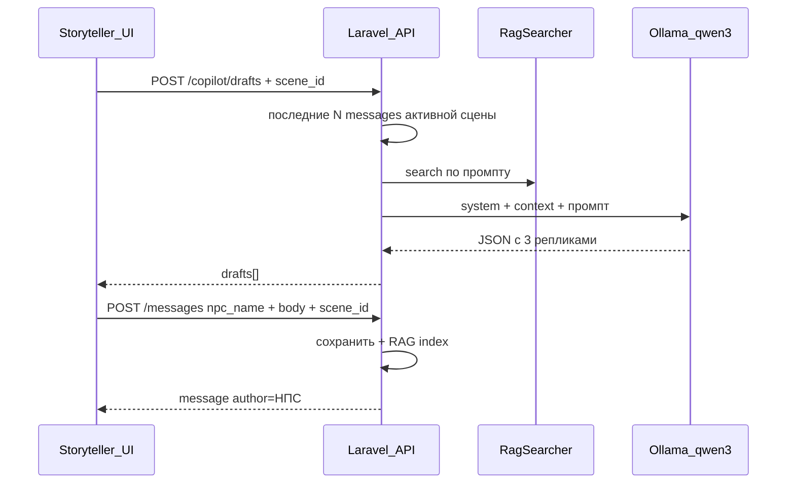

# Copilot (фича)

ИИ-помощник рассказчика: генерация черновиков реплик НПС и отправка в активную сцену.

**Статус:** MVP готов (этапы 5–6). См. [[Project/Roadmap]].

## Продуктовое поведение

Рассказчик в боковой панели `ChatView.vue`:

1. Вводит **имя НПС** и **ситуационный промпт** (тон, контекст, что должно произойти)
2. Жмёт **Сгенерировать** → API возвращает **3 черновика** (не отправляются автоматически)
3. Выбирает черновик, **редактирует** при необходимости
4. Жмёт **Отправить в чат** → сообщение в активной сцене с `author` = имя НПС

Игроки панель не видят. Обычная отправка от своего имени не меняется.
Copilot доступен только для активной сцены. Основа будущего сжатия описана в [[Architecture/Context]].

## Поток данных

## API

- Генерация: [[API/Copilot]]
- Отправка: [[API/Messages]] с `npc_name`

## UI

См. [[Architecture/Frontend]].

## Вне scope (MVP)

- Таблицы `npcs`, `events`, `relationships`, файлы `world/`
- Стриминг, `laravel/ai`
- Файловый лор и карточки НПС в контексте генерации
