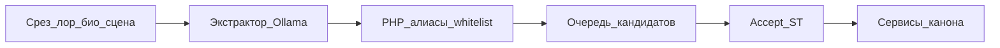

# Экстрактор графа

**Статус:** к исполнению (код не начат). Заменяет отложенный «этап 3» прицела (LLM-черновик узлов/рёбер на accept). Не этап архива [[Archive/Architecture Migration]].

Канон этого плана — эта заметка. Файл в `.cursor/plans/` каноном не является.

Модель читает **срез** (статья лора, биография, позже лента сцены) и компактный каталог уже известных имён. На выход — **кандидаты**, не INSERT. В канон — только принять / слить / отбросить, через те же сервисы, что кнопки UI: [[Architecture/World|WorldEntityService]], `WorldRelationService`, позже `WorldEventService` и [[Architecture/Memory|CharacterMemoryService]].

Биографию по умолчанию не предлагать как события мира (ложь персонажа). Готовый NER (Natasha / spaCy-ru) в таблицы — нет.



[[Features/Copilot]] (топики → поиск → реплика) в эту цепь не входит и граф не пишет.

Связанное: [[Project/Roadmap]], [[Architecture/World]], [[Architecture/Lore]], [[Architecture/Memory]], [[Architecture/Context]], [[API/Copilot]].

## Три вызова

| Кто | Когда | Пишет граф |
|-----|-------|------------|
| Copilot | реплика NPC | нет |
| Экстрактор лора / био | кнопка рассказчика | нет, только очередь |
| Экстрактор сцены | кнопка рассказчика, не каждое сообщение | нет, та же очередь |

Не вешать экстракцию на `PATCH /scenes/{id}/close`: закрытие сцены не ждёт LLM.

## Что переиспользовать

Не изобретать второй граф и не звать NER.

- Copilot: `ChatProvider` → `OllamaChatProvider` (**не** перепривязывать синглтон).
- Экстрактор: отдельный биндинг с тем же интерфейсом `ChatProvider` (или узкий `complete`).
- Алиасы: `AliasNormalizer`, `WorldEntityService::findByAlias`.
- Рёбра: enabled-ключи `world_relation_types` (`WorldRelationTypeCatalog`, `WorldRelationTypeValidator` на `relate()`).
- События: таблицы и `WorldEventService` есть; HTTP/SPA нет.
- Память: `CharacterMemoryService::remember()` есть; редактора в SPA нет.
- Образец аудита черновика: `copilot_requests`.

## Клиент модели

Сейчас — **локальная** Ollama (та же машина, что Copilot). По умолчанию chat-модель Copilot; отдельный `EXTRACTOR_OLLAMA_MODEL`, если позже поставите более сильную локальную без смены реплик.

Задел на смену, не текущая работа: `EXTRACTOR_DRIVER=ollama|none|openai_compat`. Внешний ключ (DeepSeek и аналоги) в этом плане не подключать. `none` — 503, кнопка скрыта. Copilot внешним API не подменять.

Вход модели: текст среза + компактный каталог `id | type | name | aliases` активных сущностей хроники. Не тащить всю хронику, био+лор+ленту одним запросом.

Низкая температура. Ответ — JSON. Сломанный JSON → 502 (как у Copilot), очередь пустая.

Слабая локальная модель не повод писать FK из ответа LLM: упоминания текстом, сопоставление в PHP.

Тесты: `Http::fake` на Ollama, как в Copilot. Живой внешний API в `.env.example` не добавлять.

## Кандидат

LLM **не** ставит `entity_id`. Смысл формы (имена полей можно сжать):

```json
{
  "mentions": [{ "name": "Камарилья", "kind": "faction" }],
  "relations": [{ "source": "Виктория", "target": "Камарилья", "key": "member_of" }],
  "events": [{ "title": "…", "summary": "…", "participants": ["Виктория"] }],
  "memories": [{ "character": "Виктория", "text": "…", "node_type": "event" }]
}
```

`key` только из enabled-строк `world_relation_types`. Неизвестный ключ — не INSERT (отбросить или пометить «не из списка»).

После PHP:

- имя совпало с алиасом → `matched_entity_id`
- не совпало → кандидат `new_entity` (имя + предполагаемый тип), не `create`
- у relation оба конца — matched **или** accepted-new в том же прогоне (сначала сущность, потом ребро)

Статусы: `pending` / `accepted` / `merged` / `discarded`. Accept зовёт тот же сервис, что кнопка UI.

Источник режет виды кандидатов:

| Вход | Предлагать | Не предлагать |
|------|------------|---------------|
| Статья лора | mentions, relations | память NPC; события — не в этапе 2 |
| Биография | memory **этого** персонажа | `world_events`, канон мира «как факт» |
| Сцена | events + relations | новые статьи лора |

## Очередь

Таблица вроде `extraction_runs`: chronicle, `source_type` (`lore` / `biography` / `scene`), `source_id`, driver/model, raw JSON, `candidates` jsonb, user, timestamps. Плоские строки кандидатов не обязательны, если статусы живут в JSON.

ST-only API (набросок):

- `POST /api/extract` — прогон (`lore_entry_id` \| `character_id` \| `scene_id`)
- `GET /api/extract/{run}`
- `POST /api/extract/{run}/candidates/{i}/accept` и `…/discard`

Пока `EXTRACTOR_DRIVER=none` — даже POST не предлагает «попробуем Copilot-модель втихую». При `ollama` кнопка видна.

UI первого захода — не отдельный продукт: кнопка «Разобрать» на статье лора и на био листа, список pending принять/отбросить. Полноценный редактор памяти и карточки событий — не этапы 1–3. Accept события — когда появится тонкий HTTP `WorldEventService` (этап 4).

## Этапы

Код по этому плану **пока не пишем**. Порядок, когда дойдёте:

### 1. Клиент + очередь, без канона

Драйвер `ollama`, `extraction_runs`, POST/GET, PHP-матчинг алиасов, отсев ключей рёбер. Тесты fake HTTP: matched / new_entity / unknown `relation_key`. Docs: [[Development/Environment]], API-заметка экстрактора. Copilot не трогать.

**Приёмка:** прогон сохраняется; `world_entities` / `world_relations` пусты, пока нет accept.

### 2. Лор: кнопка и accept сущностей/рёбер

Срез = `canonical_text` статьи + каталог. Accept `new_entity` → `WorldEntityService::create`. Accept relation → `WorldRelationService::relate` (активный дубликат — как сейчас, не второй ряд). События и память с лора не включать.

**Приёмка:** известное имя → ребро после accept; выдуманное → pending `new_entity`, `create` только по Accept.

### 3. Био: только память

Срез = био этого персонажа. Кандидаты `memories` → `CharacterMemoryService::remember`. Если модель прислала `events` — PHP выкидывает. SPA памяти по-прежнему нет: accept из очереди на листе достаточен.

**Приёмка:** био не создаёт `world_events`.

### 4. Сцены — тем же контрактом

Не в первом PR. Кнопка у рассказчика на чате / закрытой сцене, не автомат на сообщение и не хук close. Срез = сообщения сцены (+ участники). Главное: events + relations, не новые `lore_entries`. Accept события → typed event + `WorldEventService` (participants/sources с `message_id`). Здесь же — минимальный ST HTTP событий, если его ещё нет; не полный редактор мира.

Память сцены (кто что запомнил) — **после** этапа 4, отдельно: субъективно, по персонажу, не канон.

**Приёмка:** лента сцены даёт событие+рёбра в очередь; Copilot drafts по-прежнему без INSERT в граф.

## Сознательно нет

Автозапись из Copilot. Natasha / spaCy. Матрица NPC×NPC. Стриминг. Внутриигровые часы. Подмена Ollama у реплик. Разбор всей хроники одним запросом. Прод-подключение внешнего LLM в этом цикле. Автоизвлечение при закрытии сцены.

## Открыто (мало)

Точное имя `EXTRACTOR_OLLAMA_MODEL` (дефолт = chat Copilot). Merge в UI сразу или достаточно accept/discard.
